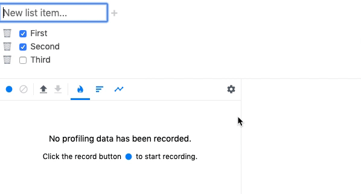

When developing in React, you will likely run into scenarios where components are rerendering more than you would expect; which can have a direct impact on an application's perceived performance. 

And with the introduction of React Hooks, developers now have even more ways to inadvertently trigger rerenders (looking at you `useEffect`!).

Thankfully React gives developers several tools to help them find the source of unnecessary rerenders. In this post I'll discuss three of them: [DevTools Profiler](https://reactjs.org/blog/2018/09/10/introducing-the-react-profiler.html), [React.memo](https://reactjs.org/docs/react-api.html#reactmemo), and [React.Profiler](https://reactjs.org/docs/profiler.html).

## DevTools Profiler

[DevTools Profiler](https://reactjs.org/blog/2018/09/10/introducing-the-react-profiler.html) is a fantastic browser plugin that is currently available in Chrome & Firefox (there is also a Node version). Check out the docs to learn more about specific features.

Version 4 of React DevTools -- released August 15, 2019 -- came with a great new feature called ["Why did this render?"](https://github.com/facebook/react/blob/master/packages/react-devtools/CHANGELOG.md#why-did-this-render).



To use this tool, simply install Profiler and turn on the _"Record why each component rendered while profiling."_ option. You can then run Profiler while interacting with your app, focusing on whichever components may be rendering unnecessarily. 

After you end the Profiler session, you'll be able to drill down into individual components to see their render metrics. Under the _"Why did this render?"_ heading you'll see a list of reasons the component rendered/rerendered. 

Common reasons for rerendering: 
- Hooks changing (ie `useState`'s `setState` methode being called)
- props changing (it will list the exact props!)
- a component's parent rerendering

Of all the debugging tools, I'd say this is the easiest and fastest to set up and use. But there is one shortcoming: there is no way to inspect the __value__ of the props that changed; and it's often helpful to be able to inspect prop values to get a better understanding of what is changing, and why. 

To get this data you can use another tool: `React.memo`.

## React.memo

React v16.6.0 gave us a new [React.memo](https://reactjs.org/docs/react-api.html#reactmemo) method that can be used with both functional and class-based components to give us more control over rerenders, similar to the `shouldComponentUpdate` class component method. Not only is it a good tool for controlling rerenders, it can also be a helpful tool when trying to find the cause of rerenders.

The key to debugging rerenders is to use the second optional argument of `React.memo` which is an "isEqual" function that takes two arguments, `prevProps` and `nextProps`, and gives you control over whether a component should change. See the [React docs](https://reactjs.org/docs/react-api.html#reactmemo) for `memo` for more details.

Now with access to `prevProps` and `nextProps`, you can easily view what is changing and determine the root cause of rerenders:

```js
const memoizedComponent = React.memo(MyComponent, 
  (prevProps, nextProps) => {

    console.log(prevProps.thing === nextProps.thing);

    /*
      When using this function you always need to return
      a Boolean. For now we'll say the props are NOT equal 
      which means the component should rerender.
    */
    return false;
  }
)
```

Side note: while you can use `React.memo` to manually prevent rerenders once you find the issue, I highly recommend dealing with the root cause -- which is more often than not a prop that is being unnecessarily recreated on every render. Otherwise you'll end up band-aiding every component with `React.memo` which will result in lots equality checks, plus data being stored in memory. 

## React.Profiler

Finally, let's take a look at the [React.Profiler](https://reactjs.org/docs/profiler.html) API, which gives developers additional data points that can be used to debug performance issues. 

With `React.Profiler`, developers can wrap their JSX elements with a `<Profiler>` component, which takes two props:

1. __id__ - a unique identifies for the section being profiled.
1. __onRender__ - a callback function to be called on every render. Check out the [docs](https://reactjs.org/docs/profiler.html#onrender-callback) for a full list of the callback parameters.

```js
return (
  <Profiler 
    id="test1" 
    onRender={(...args) => {
      { [1]: phase, [2]: actualDuraction } = args;

      console.log({ phase, actualDuration })
    }}
  >
    <App />
  </Profiler>
);

```

Here a few things you can check when debugging rerenders using `React.Profiler`:

- Ensure a component never reverts to the `mount` phase after the initial render; it should always be `updated`.
- The `actualDuraction` should go down after the initial render. If it stays the same or goes up, you are likely not rendering children efficiently.
- To better understand which action is triggering a rerender, who can track timestamps of multiple actions and see which correlate with the `startTime`.
- `baseDuration` will tell you the worst case scenario when a component rerenders. Components with the highest `baseDuration` are the ones you want to pay extra attention to when optimizing rerenders.

 That's it! Happy debugging!


